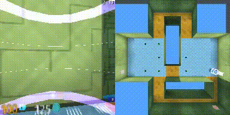
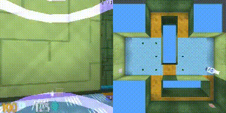

# Memory-Augmented Reinforcement Learning In 3D Space
**(This project was the champion of the 2023 National Tsing Hua University Computer Science Department's Project Contest!)**

In this project, we propose a new episodic memory framework to enhance the ability of the reinforcement learning model to acquire spatial information in a partially observed 3D environment, thereby improving the model's capability to execute tasks within such an environment.

### Performance (Average score on collecting apples in 100 different mazes)
<center>

|Baseline (DQN) | Ours approach |
|:-----------:|:-----------:|
|8.4 +/- 6.3|**10.3 +/- 9.1**|

</center>

### Demo
<center>

| Baseline (DQN) | Ours approach |
|:-----------:|:------------:|
|||

</center>


### Architecture


## Installation on Linux

Install [DeepMind Lab](https://github.com/google-deepmind/lab)

Install [Pytorch](https://pytorch.org/get-started/locally/)

Install required packages
```shell
pip install numpy Pillow opencv-python matplotlib 
```

## Create Task Environment
Create `explore_object_locations_xs.lua` with the above spec in DeepMind Lab `game_script/levels` subfolder.
```lua
local factory = require 'factories.explore.object_locations_factory'

return factory.createLevelApi{
    episodeLengthSeconds = 135,
    mazeHeight = 9,
    mazeWidth = 9,
    roomCount = 2,
    roomMaxSize = 3,
    roomMinSize = 3,
    objectCount = 8,
    spawnCount = 2,
}
```

Install level
```shell
pip install dm-env
```
```shell
bazel build -c opt --python_version=PY3 //python/pip_package:build_pip_package
```
```shell
./bazel-bin/python/pip_package/build_pip_package /tmp/dmlab_pkg
```
```shell
pip install /tmp/dmlab_pkg/deepmind_lab-1.0-py3-none-any.whl
```

## Training
```shell
# Train our proposed reinforcement learning model.
python run_emdqn.py
```

## Testing
```shell
# Test our proposed reinforcement learning model in 100 different maze benchmark.
python run_emdqn.py --test --exp_name {exp name after training} --step {checkpoint step}
```
